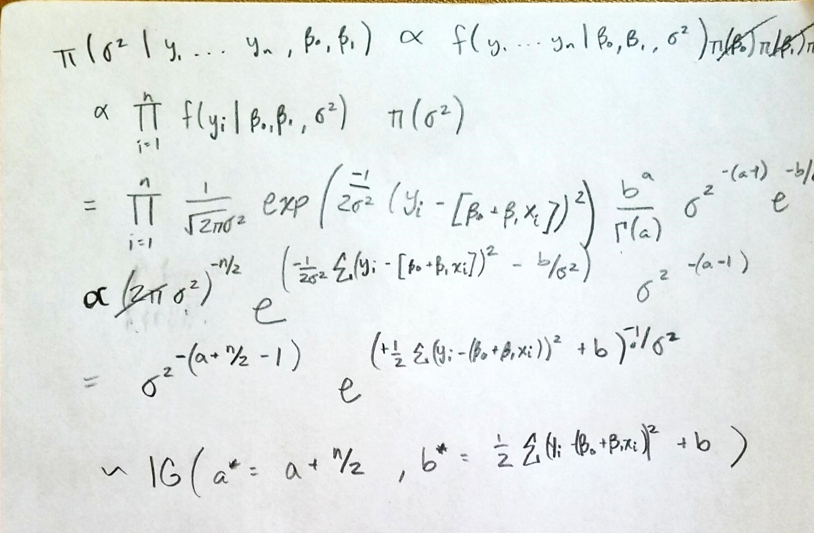

A researcher measured heart rate (x) and oxygen uptake (y) for one person under varying exercise conditions. He wishes to determine if heart rate, which is easier to measure, can be used to predict oxygen uptake. If so, then the estimated oxygen uptake based on the measured heart rate can be used in place of the measured oxygen uptake for later experiments on the individual. 
```{r}
library(invgamma)
X <- c(94, 96, 94, 95, 104, 106, 108, 113, 115, 121, 131)
Y <- c(0.47, 0.75, 0.83, 0.98, 1.18, 1.29, 1.40, 1.60, 1.75, 1.90, 2.23)
```

To learn about this assocation the researcher decides to employ a simple linear regression model which is the
following:
yi = β0 + β1xi + i with yi ∼ N(0, σ2)

a) The Assumptions

1. Association between X and Y is linear
2. The errors are independent
3. Errors are randomly distributed
4. The Spread of the line is constant

b) Plot oxygen uptake (y) versus heart rate (x) using a scatterplot with both axis correctly labeled
```{r, fig.align='center'}
plot(X,Y,pch=20,xlab="Heart Rate",ylab="Oxygen Uptake",main="Scatter Plot")
```

c) Using the lm function in R fit the simple linear regression model and plot it. (Hint: you fit the model using lm(y ∼ x))
```{r,fig.align='center'}
slr_out <- lm(Y ~ X)
summary(slr_out)
plot(X,Y,pch=20,xlab="Heart Rate",ylab="Oxygen Uptake",main="Scatter Plot")
abline(slr_out, col = 'red')
```


(d) Perform the hypothesis test H0: β1 = 0 vs H1: β1 > 0. What conclusions can you make?
```{r}
1-pt(12.62,df=9)
```
We reject the null hypothesis in favor of the alternative hypothesis, and conclude that β1 > 0. Heart Rate has a significant effect on Oxygen Intake. 

You should always explore the appropriateness of the assumptions that accompany the model, but I won’t
have you explore them for this homework.

Now we are going to perform a Bayesian analysis. To do this we reexpress the simple linear regression model as:
yi|β0, β1, σ2, xi ∼ N(β0 + β1xi, σ2)
and assume the following prior distributions
• β0 ∼ N(m0, v0)
• β1 ∼ N(m1, v1)
• σ2 ∼ IG(shape = a,rate = b)

(f) What are the assumptions associated with the Bayesian simple linear regression model?

1. Same as above
2. We take on prior distribution assumptions

(g) Show that full conditional for σ2 is what I listed above. Showing this should in theory consist of three or four steps.
```{r, echo=FALSE, fig.cap='Derivation of full conditional for σ2', out.width = '100%', fig.align='center'}
 ## Need to change thiss
```

(h) Write a computer program that employs a Gibbs-sampler to sample from the joint posterior distribution of β0, β1, and σ2. For prior distribution parameters use m0 = m1 = 0, v0 = v1 = 100, and a = b = 1. Comment very briefly on if you think these values produce reasonable prior distributions.
```{r}
n <- length(X)

# prior values
m0 <- m1 <- 0
v0 <- v1 <- 100
a <- b <- 1

# empty vectory to store MCMC draws
beta0 <- beta1 <- sigma2 <- numeric()

# starting values
beta0[1] <- 0
beta1[1] <- 0
sigma2[1] <- 1

# number of MCMC draws
J <- 1000000

sumx2 <- sum(X^2)

# Gibbs-sampler for-loop
for(j in 2:J){
	
	# update sigma2	
	astar <- 0.5*n + a
	bstar <- 0.5*sum((Y - (beta0[j-1] + beta1[j-1]*X))^2) + b
	sigma2[j] <- rinvgamma(1, shape=astar, rate=bstar)
	
	# update beta0
	vstar <- 1/(n/sigma2[j] + 1/v0)
	mstar <- vstar*((1/sigma2[j])*sum(Y - beta1[j-1]*X) + (1/v0)*m0)
	beta0[j] <- rnorm(1, mstar, sqrt(vstar))	
	
	# update beta1
	vstar <- 1/(sumx2/sigma2[j]  + 1/v1)
	mstar <- vstar*((1/sigma2[j])*sum(X*(Y  - beta0[j])) + (1/v1)*m1)
	beta1[j] <- rnorm(1, mstar, sqrt(vstar))
	
}
```

(i) Argue that the algorithm has converged using trace plots and discuss briefly the “mixing” of the chain using autocorrelation plots (e.g., use acf function in R).

Examine burn-in and mixing
```{r,fig.align='center'}
keep <- seq(1000, J, by=100)

plot(beta1[keep], type='l')
acf(beta1[keep])
plot(beta0[keep], type='l')
acf(beta0[keep])
plot(sigma2[keep], type='l')
acf(sigma2[keep])
```

After skipping the first 1000 and then skipping to every 100th MCMC draws after that the ACF and trace plots look acceptable.

(j) Plot the posterior (after removing enough burn-in draws) and prior distribution in the same graph for
each parameter (this part should consist of three plots). Make sure to appropriately label the figures.
```{r,fig.align='center'}
xs <- seq(-8,8,length.out=1001)
plot(density(beta0[keep]),xlim=c(-8,8),main="Prior and Posterior of Beta0",xlab="Beta0",ylab="Density")
lines(xs, dnorm(xs,mean=0,sd=10),col="gray")
legend("topright", c("Prior", "Posterior"), lty=c(1,1), col = c("gray","black"))
```

```{r}
xs <- seq(-.2,.2,length.out=1001)
plot(density(beta1[keep]),xlim=c(-.2,.2),main="Prior and Posterior of Beta1",xlab="Beta1",ylab="Density")
lines(xs, dnorm(xs,mean=0,sd=10),col="gray")
legend("topright", c("Prior", "Posterior"), lty=c(1,1), col = c("gray","black"))
```

```{r}
xs <- seq(0,3,length.out=1001)
plot(density(sigma2[keep]),xlim=c(0,3),main="Prior and Posterior of Sigma2",xlab="Sigma2",ylab="Density")
lines(xs, dinvgamma(xs,shape=a,rate=b),col="gray")
legend("topright", c("Prior", "Posterior"), lty=c(1,1), col = c("gray","black"))
```

(k) Create a scatter plot that contains the data, the least squares line from part (c) and the the fitted Bayesian regression line. Use the color red for the least squares line and blue for the Bayesian line. Comment briefly on the differences you see between the frequentist fit and Bayesian fit
```{r}
xvals <- seq(min(X), max(X), length=100)
reglines <- matrix(NA, nrow=length(keep), ncol=length(xvals))
jjj <- 1
for(jj in keep){

	reglines[jjj,] <- beta0[jj] + beta1[jj]*xvals
	jjj <- jjj + 1
}

plot(X,Y,pch=20,xlab="Heart Rate",ylab="Oxygen Uptake",main="Scatter Plot")
# Plot regression line using approach 2
mn.line <- apply(reglines,2,mean) # calculate the mean regression line
ci.line <- apply(reglines, 2, function(x) quantile(x, c(0.025, 0.975)))# Upper and Lower
lines(xvals, mn.line, col='blue', lwd=2)
lines(xvals, ci.line[1,], col='blue', lty=2, lwd=3)
lines(xvals, ci.line[2,], col='blue', lty=2, lwd=3)
abline(slr_out, col = 'red',lty=2,lwd=3)
legend("topleft", c("Frequentist", "Bayesian"), lty=c(2,1),lwd=c(3,3),col=c("red", "blue"))
```

(l) Test the hypothesis that H0: β1 = 0 vs H1: β1 > 0. We did not discuss how to do this type of hypothesis test from a Bayesian perspectve. As you might imagine, testing the hypothsis will require using the posterior distribution of β1. Try your best to come up with a testing procedure based on the posterior distribution for β1 that permits you to make a conclusion associated with the competing hypothses. Ask yourself, “What would convince me (based on the posterior distribution of β1) that the hypothsis is wrong?”
```{r}
mean(beta1[keep] <= 0)
quantile(beta1[keep],c(0.025,0.975))
```
Since the 95% credible interval does not include 0, we can reject the null hypothesis in favor of the alternative that β1 > 0.


(m) For the last problem of this homework, we will consider the posterior predictive in a regression setting. For a new individual with a heart-rate of 95 collect the same number of draws from the posterior predictive distribution as you collected from the joint posterior distribution of β0, β1, and σ2 (after burn-in). What is the support of the posterior predictive distribution in a regression setting? Plot the distribution and briefly describe the information that it provides.
```{r}
# Posterior predictive for xval = 95
ppx95 <- rnorm(length(keep), beta0[keep] + beta1[keep]*95, sqrt(sigma2[keep]))

hist(ppx95,breaks=20)
mean(ppx95)
quantile(ppx95, c(0.025, 0.975))
```

The support of the posterior predictive is negative infiniti to positive infiniti, since we assumed that Y is normally distributed. This histogram provides a distribution of where predictions would come from for an individual with a heart rate of 95. The peak of the distribution is just below 1 (mean of 0.81). 


