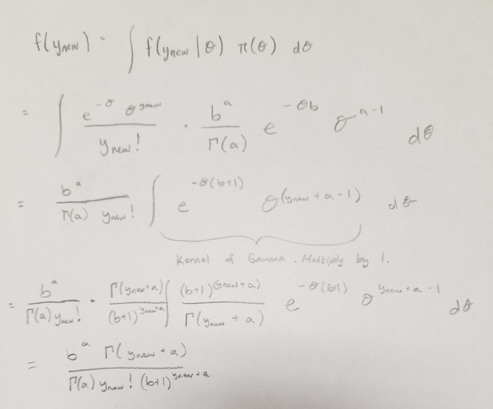

Remember to submit your R code along with the completed homework. You must include any requested plots and make sure to include your final answers to all questions in the writeup.


The Orem City Department of Public Works is responsible for repairing potholes in city streets. Although not exactly right, it is reasonable to assume that the number of potholes that need to be repaired in a city block follows a Poisson(θ) distribution. If the prior belief about θ is that it follows a gamma distribution with shape=.5 and rate=0.5,

(a) According to the prior distribution, what is the expected number of potholes per block?
Y~Poisson($\theta$) and $\theta$~Gamma(a=.5,b=.5)
$$ E(Y) = E(\theta) = \frac{a}{b} $$
```{r}
a <- .5
b <- .5
a/b
```

(b) What is the prior probability that θ exceeds 2.7?
```{r}
1 - pgamma(2.7,shape = a, rate = b)
```


After a particularly heavy winter, they repaired the following number of potholes in each block along a 20 block stretch of State St: 3 3 7 1 4 6 6 7 3 1 5 5 5 3 3 0 3 1 2 2. We will assume that these data have a Poisson(θ) distribution. If Orem City’s prior belief about θ is as in the previous problem,

(a) What is the posterior distribution of θ?
```{r}
potholes <- c(3, 3, 7, 1, 4, 6, 6, 7, 3, 1, 5, 5, 5, 3, 3, 0, 3, 1, 2, 2)
a_star <- a + sum(potholes)
b_star <- b + length(potholes)
print(paste("a* =", a_star))
print(paste("b* =", b_star))
```

$$ \theta \sim Gamma(a^*= 70.5, \ b^*=20.5) $$

(b) What is their belief now, after seeing the data, about the expected number of potholes they will repair in each block of State St? 
$$ E(\theta|Y) = \frac{a^*}{b^*} $$
```{r}
a_star/b_star
```

(c) What is a 95% (posterior) credible interval for the parameter of the Poisson distribution?
```{r}
qgamma(c(.025, .975), shape = a_star, rate = b_star)
```

(d) What is the updated (i.e., posterior) probability that θ is greater than 2.7?
```{r}
1 - pgamma(2.7, shape = a_star, rate = b_star)
```


The Utah Highway Patrol believes the number of accidents per week along a 50 mile stretch of I-15 follows a Poisson(θ) distribution. Suppose their current belief about θ is that it follows a gamma distribution with shape=5.1 and scale=.8.

(a) In our class we discussed two parametrizations of the gamma distribution. Here we consider the parametrization in terms of shape and rate, rather than in terms of shape and scale. For their prior beliefs, what would the shape and rate inputs be for the gamma distribution? 
$$ shape = 5.1 $$ 
$$rate = \frac{1}{scale} = 1.25 $$

(b) Derive the prior predictive distribution and use it to find the probability that in the next week there will be at least 3 accidents? What does this probability say about the appropriateness (or lack there of) of the prior distribution used by the Utah Highway Patrol?
```{r, echo=FALSE, fig.cap="Poisson-Gamma Predictive", out.width = '100%'}

```


```{r}
gp_predictive <- function(ynew, shape, rate = 1/scale, scale = 1/rate) {
  (rate ** shape) * (gamma(ynew + shape)) / ( (1 + rate)**(ynew + shape) * factorial(ynew) * gamma(shape)) 
}
```

```{r}
gp_predictive(3, shape = 5.1, rate = 1.25)
```

(c) If in the next week there were 5 accidents, what is their updated distribution for θ? Plot the prior distribution and posterior distribution on the same graph. (Prior in gray, posterior in black.)
```{r, fig.align='center'}
a <- 5.1
b <- 1.25
a_star <- a + 5
b_star <- b + 1
thetas <- seq(0,15, length.out = 1001)
plot(thetas, dgamma(thetas, shape = a_star, rate = b_star), col = 'black', type = 'l',
     main = expression(paste("Prior/Posterior of ", theta)), xlab = expression(theta), ylab = 'Density')
lines(thetas, dgamma(thetas, shape = a, rate = b), col = 'gray', type = 'l')
legend("topright", c("After 1 Week", "Prior"), col = c("black", "gray"), lty = 1)
```


(d) In the month following the week with 5 accidents, there were 2, 0, 6, and 3 accidents per week. What is the new posterior for θ now? Plot it in red on the same graph as in part b.
```{r, fig.align='center'}
accidents <- c(2,0,6,3)
a_star_star <- a_star + sum(accidents)
b_star_star <- b_star + length(accidents)
plot(thetas, dgamma(thetas, shape = a_star_star, rate = b_star_star), col = 'red', type = 'l',
     main = expression(paste("Prior/Posterior of ", theta, " After One Month")), 
     xlab = expression(theta), ylab = 'Density')
lines(thetas, dgamma(thetas, shape = a_star, rate = b_star), col = 'black', type = 'l')
lines(thetas, dgamma(thetas, shape = a, rate = b), col = 'gray', type = 'l')
legend("topright", c("After 1 Month", "After 1 Week", "Prior"), col = c("red", "black", "gray"), lty = 1)
```

(e) Derive the posterior predictive distribution and use it to find the predictive probability that in the next week, there will be at least 3 accidents?
$$ \theta \sim Gamma(a^*= 21.1, \ b^*= 6.25) $$
```{r}
1 - sum(gp_predictive(0:2, shape = a_star_star, rate = b_star_star))
```


The City of Orem is interested in knowing if a new paving method will reduce the number of needed pothole repairs along State St. Since they know that the severity of the winter weather also affects the number of potholes, they collected data over a ten-year period prior to when the new paving method was used, and for 6 years after. For the ten years prior to the new method (the “before” period), the number of potholes in a “winter month” was as follows: 27 30 25 29 27 23 29 24 27 36 33 34 30 25 29 27 33 33 27 34 28 43 31 24 36 28 26 29 30 20 33. For the 6 years after the new method was used (the “after” period) the number of potholes in a “winter month” was as follows: 26 32 21 32 21 24 36 26 24 25 30 25 20 14 26 28 21 21. Use a gamma(shape=5, rate=0.2) prior for both cases (i.e., for θ during the before period and for θ during the after period).

(a) What is the posterior probability that the (population) rate of potholes in a “winter month” was higher before the new paving method was used than it was after the new paving method was used?
```{r}
before <- c(27, 30, 25, 29, 27, 23, 29, 24, 27, 36, 33, 34, 30, 25, 29, 27, 33, 33, 27, 34,
            28, 43, 31, 24, 36, 28, 26, 29, 30, 20, 33)
after <- c(26, 32, 21, 32, 21, 24, 36, 26, 24, 25, 30, 25, 20, 14, 26, 28, 21, 21)
a <- 5
b <- 0.2
a_before <- a + sum(before)
b_before <- b + length(before)
a_after <- a + sum(after)
b_after <- b + length(after)
J <- 10000
sim_before <- rgamma(J, shape = a_before, rate = b_before)
sim_after <- rgamma(J, shape = a_after, rate = b_after)
mean(sim_before > sim_after)
```

(b) What are the mean and median of the posterior distribution of d = θbefore − θafter?
```{r}
mean(sim_before - sim_after)
median(sim_before - sim_after)
```


(c) Report and interpret in context a 95% (posterior) credible interval for d = θbefore − θafter?
```{r}
quantile(sim_before - sim_after, c(.025, .975))
```
There is a 95% probability that the true difference in rate of potholes per month before the new paving method and after is between 1.22 and 7.19. Since this interval is greater than 0, we can say that the new paving method has reduced the rate of potholes per month.

