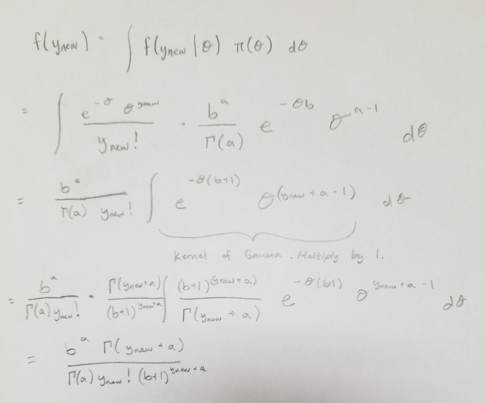

```{r}
library(invgamma)
a_update <- function(a, Y) {
  return( a + (length(Y) / 2))
}
b_update <- function(b,mu,Y) {
  return(b + sum((Y - mu)**2)/2)
}
```

## Part 1 ## 
A study was done to see if taking a fish oil supplement lowered blood pressure. For the seven subjects the change in blood pressure was: 8, 12, 10, 14, 2, 0, 0. The study organizers felt it was reasonable to assume the data were conditionally iid and normally distributed with known mean $\mu$ = 6.3 and variance $\sigma^2$. For the prior distribution for $\sigma^2$, we have chosen an inverse-gamma with shape=2.01 and rate=49.

(a) Derive the posterior distribution of $\sigma^2$. (That is, show that the posterior distribution of $\sigma^2$ is an inversegamma)
```{r, echo=FALSE, fig.cap='Derivation of Normal - Inverse Gamma', out.width = '100%', fig.align='center'}

```

(b) Refer to part a. Plot the prior and the posterior distributions for $\sigma^2$ on the same graph. Make sure to include a legend to distinguish the prior from the posterior.
```{r, fig.align='center'}
mu <- 6.3
a <- 2.01
b <- 49
blood <- c(8, 12, 10, 14, 2, 0, 0)
a_star <- a_update(a,blood)
b_star <- b_update(b,mu,blood)
thetas <- seq(0,100,length.out = 1001)
plot(thetas, dinvgamma(thetas,shape = a_star, rate = b_star), 
     type = 'l',
     main = "Prior and Posterior",
     xlab = expression(sigma**2),
     ylab = 'Density')
lines(thetas,dinvgamma(thetas,shape = a, rate = b), col = 'gray')
legend('topright', c("Prior","Posterior"), col = c("gray","black"), lty = 1)
```


## Part 2 ##
Ten policemen working in downtown Cairo had their blood sampled to determine the level of lead concentration. We assume the data are conditionally iid with the N($\mu = 20$, $\sigma^2$) distribution. The ten observed data points were: 17.4, 13.4, 27.3, 25.1, 23.4, 13.6, 38.2, 23.5, 20.7, 28.3. The prior for $\sigma^2$ is the inverse gamma distribution with shape=4.5 and rate=240 (i.e., $\sigma^2$ ∼ IG(4.5, 240)).

(a) Plot the prior and posterior distributions for the variance on the same graph. Make sure to include a legend to distinguish the prior from the posterior.
```{r, fig.align='center'}
mu <- 20
a <- 4.5
b <- 240
lead_conc <- c(17.4, 13.4, 27.3, 25.1, 23.4, 13.6, 38.2, 23.5, 20.7, 28.3)
a_star <- a_update(a,lead_conc)
b_star <- b_update(b,mu,lead_conc)
thetas <- seq(0,150,length.out = 1001)
plot(thetas, dinvgamma(thetas,shape = a_star, rate = b_star), 
     type = 'l',
     main = "Prior and Posterior",
     xlab = expression(sigma**2),
     ylab = 'Density')
lines(thetas,dinvgamma(thetas,shape = a, rate = b), col = 'gray')
legend('topright', c("Prior","Posterior"), col = c("gray","black"), lty = 1)
```


(b) What is the posterior probability that the variance in blood lead concentration of the population of policemen in downtown Cairo is less than 49?
```{r}
pinvgamma(49,shape = a_star, rate = b_star)
```

(c) Plot the posterior predictive distribution for the next downtown Cairo police officer’s blood lead concentration.
```{r}

```

## Part 3 ##
Here is the total serum cholesterol for 9 urban residents of Guatemala: 197, 199, 214, 217, 222, 223, 227, 228, 234. It is assumed that $Y_{urban,i}|\sigma^2_{urban} \sim N(\mu_{urban} = 220,\sigma^2_{urban})$, where $Y_{urban,i}$ denotes the total serum cholesterol for the ith individual in the sample of Guatemalan urban residents. The prior belief about $\sigma^2_{urban}$, the variance of the serum cholesterol of urban residents of Guatemala, is that it has an inverse gamma distribution with shape=2.5 and rate=600.

(a) What is the posterior distribution of the variance in this case?
```{r}
mu <- 220
urban <- c(197, 199, 214, 217, 222, 223, 227, 228, 234)
a <- 2.5
b <- 600
a_star_urban <- a_update(a,urban)
b_star_urban <- b_update(b,mu,urban)
```
Posterior: $\pi( \sigma^2 | Y) \sim$ IG(`r a_star`,`r b_star`)


(b) What is the prior expected value of $\sigma^2_{urban}$?
```{r}
b/(a+1)
```

(c) What is the posterior expected value of $\sigma^2_{urban}$?
```{r}
b_star_urban / (a_star_urban + 1)
```

(d) What is the posterior mode of $\sigma^2_{urban}$?
```{r}

```

(e) Plot the posterior and prior distribution of $\sigma^2_{urban}$ on the same graph. Make sure to include a legend to distinguish the prior from the posterior.
```{r, fig.align='center'}
thetas <- seq(0,500,length.out = 1001)
plot(thetas, dinvgamma(thetas,shape = a_star_urban, rate = b_star_urban), 
     type = 'l',
     main = "Prior and Posterior of Urban Residents",
     xlab = expression(sigma**2),
     ylab = 'Density')
lines(thetas,dinvgamma(thetas,shape = a, rate = b), col = 'gray')
legend('topright', c("Prior","Posterior"), col = c("gray","black"), lty = 1)
```


## Part 4 ##
Here is the total serum cholesterol for 10 rural residents of Guatemala: 139, 142, 143, 144, 145, 148, 155, 162, 171, 181. It is assumed that $Y_{rural,i}|\sigma^2_{rural} \sim N(\mu_{rural} = 150,\sigma^2_{rural})$, where $Y_{rural,i}$ denotes the total serum cholesterol for the ith individual in the sample of Guatemalan rural residents. The prior belief about the variance of serum cholesterol in rural Guatemalan residents is an inverse gamma with shape=2.5 and rate=600.

(a) What is the posterior distribution of the variance in this case?
```{r}
mu <- 150
rural <- c(139, 142, 143, 144, 145, 148, 155, 162, 171, 181)
a <- 2.5
b <- 600
a_star_rural <- a_update(a,rural)
b_star_rural <- b_update(b,mu,rural)
```

Posterior: $\pi( \sigma^2 | Y) \sim$ IG(`r a_star_rural`,`r b_star_rural`)


(b) Plot the posterior.
```{r, fig.align='center'}
thetas <- seq(0,500,length.out = 1001)
plot(thetas, dinvgamma(thetas,shape = a_star_rural, rate = b_star_rural), 
     type = 'l',
     main = expression(paste("Posterior of ", sigma['rural']**2)),
     xlab = expression(sigma**2),
     ylab = 'Density')
```


## Part 5 ##
Now consider the ratio of variances of the two groups:  $\sigma^2_{urban} / \sigma^2_{rural}$. 

(a) Plot the (Monte Carlo-estimated) posterior distribution of $\sigma^2_{urban} / \sigma^2_{rural}$.
```{r, fig.align='center'}
J <- 10000
sim_urban <- rinvgamma(J,shape = a_star_urban, rate = b_star_urban)
sim_rural <- rinvgamma(J, shape = a_star_rural, rate = b_star_rural)
ratios <- sim_urban / sim_rural
plot(density(ratios),
     main = expression(paste("Posterior of ", sigma['urban']**2, ' / ', sigma['rural']**2)),
     xlab = expression(paste(sigma['urban']**2, ' / ', sigma['rural']**2)),
     ylab = 'Density')
```

(b) Report and interpret a 95% posterior credible interval for this ratio.
```{r}
quantile(ratios, c(0.025, 0.975))
```

(c) Explain why it is important to determine whether the CI for the ratio of variances includes 1. (Hint: What does it imply if the ratio equals 1?)

When the ratio is around one we can conclude that the variances are equal, which is a major assumption for a lot of statistical models. 


## Part 6 ##
Plot the prior predictive distribution of $Y_{urban}$ and the posterior predictive distribution of $Y_{urban}$ on the same graph. (This of course requires a legend be included in your plot to distinguish one from the other.)
```{r}

```


