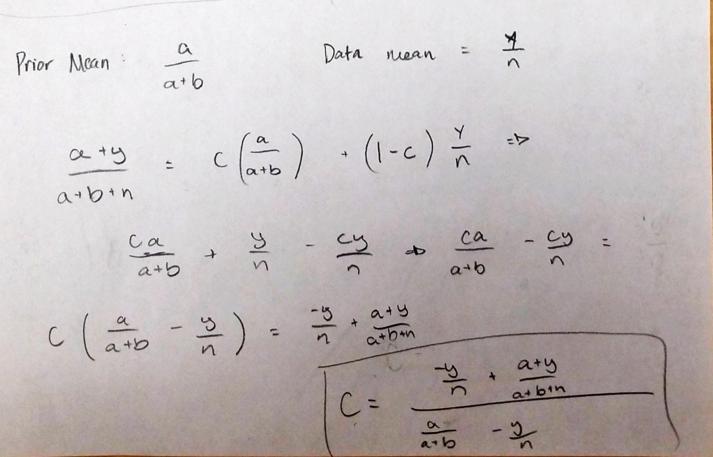
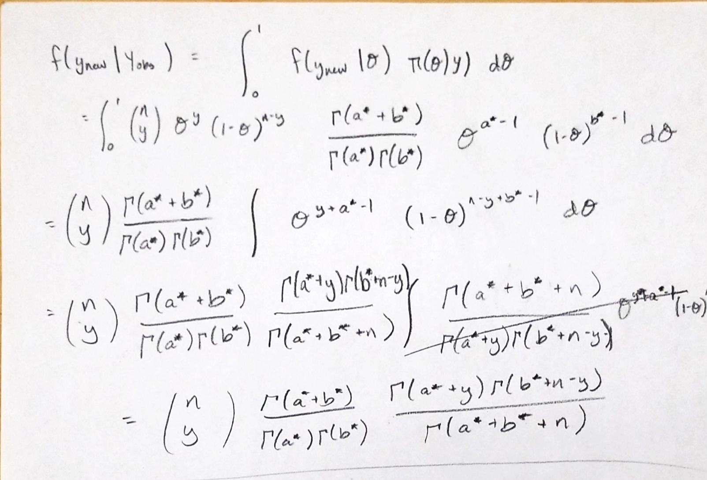

1. Formulate a Statistical data model 

We chose to do a Beta-Binomial statistical model. We let $$Y \sim Binomial(n,\theta) $$ where n = number of students in the class and $$ \theta \sim Beta(a,b) $$ to be the porportion of students that notice baldness.

2. Define Prior Distribution
$$ \pi( \theta ) = beta(12, 10) $$
We chose a = 12 and b = 10 because we think that a little more than half of the students will notice baldness, but we kept these values relatively low to let our data impact the posterior more.
```{r,fig.align='center'}
thetas <- seq(0,1,length.out = 1001)
a <- 12
b <- 10
f_theta <- dbeta(thetas,shape1 = a, shape2 = b)
plot(thetas, f_theta, type = 'l', col = 'black', 
     main = expression(paste('Prior of ', theta)), 
     xlab = expression(theta), ylab = 'Density')
```

3. Find the Posterior
```{r}
y <- c(34,45,23,40,39,66,74,53,22,28,36,39,45,41,51)
n <- c(60,72,40,62,50,95,110,90,40,40,50,50,65,65,90)
a_star <- a + sum(y)
b_star <- b + sum(n) - sum(y)
print(paste("a* = ", a_star))
print(paste("b* = ", b_star))
```

$$ \pi(\theta | Y) \sim Beta(648,353) $$
95% Credible interval for `r expression(theta)`
```{r}
interval <- qbeta(c(0.025,0.975), shape1= a_star, shape2 = b_star)
print(interval)
```

There is a 95% probability that the true proportion of individuals that notice baldness when meeting someone is between 0.617 and 0.677

```{r, fig.align='center'}
f_theta_post <- dbeta(thetas,shape1 = a_star, shape2 = b_star)
plot(thetas, f_theta_post, type = 'l', col = 'black', 
     main = expression(paste('Posterior of ', theta)), 
     xlab = expression(theta), ylab = 'Density')
lines(thetas,f_theta,type = 'l',col='gray')
abline(v=interval, col = 'red', lwd = 0.5)
text(interval[1]-.05, dbeta(interval[1],a_star,b_star), round(interval[1], 3))
text(interval[2]+.05, dbeta(interval[2],a_star,b_star), round(interval[2], 3))
legend("topright", c("Posterior", "Prior"), col = c("black", "gray"), lty = 1)
```

4. Show that the posterior means is weighted average.
```{r, echo=FALSE, fig.cap="Posterior mean is a weighted average.", out.width = '100%'}

```

5. Derive the Posterior Predictive 
```{r, echo=FALSE, fig.cap="Beta-Binomial Predictive", out.width = '100%'}

```

```{r}
bb_predictive <- function(ynew, nnew, a, b) {
  l.f.y <- lgamma(a+b) - lgamma(a) - lgamma(b) + lchoose(nnew,ynew) + 
    lgamma(a+ynew) + lgamma(b+nnew-ynew) - lgamma(a+b+nnew)
  return(exp(l.f.y))
}
```

What is the probabilty that in a class of 50 students, 35 (70%) or more of them notice baldness?
```{r}
1 - sum(bb_predictive(0:34,60,a_star,b_star))
```

6. Do females notice as much as males?
```{r}
females <- c(12,20,13,18,15,32,33,27,11,13,15,20,20,21,23)
males <- c(22,25,10,22,24,34,41,26,11,15,21,19,25,20,28)
```

Statistical Model: I am going to stick with a Beta-Binomial model. Let Y = Number of females that notice baldness out of n people that did notice. A big assumption that I am making here is that the proportion of females in each class is 50%, since we do not have the data about how many males or females in each class. I cannot use a poisson because the class size varies so much, as would the total number of males/females in each class. The Beta-Binomial will allow me to compare the proportion of males that notice to the proportion of females that notice. 

Of the people that notice, what proportion of them are female? Since males and females are compliments, I can just test whether or not $ \theta _{f} = .50 $, where $ \theta _{f} $ is the proportion of females noticing baldness. But for this assignment I think I am supposed to use Monte Carlo, so I will do that. 

X = Number of Females that notice baldness. $ X \sim Binomial(n,\theta_{f}) $ with $\theta_{f} \sim Beta(a=3,b=2) $
Y = Number of Females that notice baldness. $ Y \sim Binomial(n,\theta_{m}) $ with $\theta_{m} \sim Beta(a=3,b=2) $
I am setting the priors for a and b to 1 because I want them to be the same for males and females and I think that the true proportion of both noticing baldness is around .6.

8. Find Posterior and make concrete statement.
```{r}
n <- females + males
J <- 10000

af <- 3
bf <- 2
af_star <- af + sum(females)
bf_star <- bf + sum(n) - sum(females)
sim_theta_f <- rbeta(J,shape1 = af_star, shape2 = bf_star)

am <- 3
bm <- 2
am_star <- am + sum(males)
bm_star <- bm + sum(n) - sum(males)
sim_theta_m <- rbeta(J, shape1 = am_star, shape2 = bm_star)

diffs <- sim_theta_f - sim_theta_m
mean(diffs)
```

```{r}
interval <- quantile(diffs,c(0.025, 0.975))
interval
```
There is a 95% probability that the proportion of females notices baldness minus the proportion of males notices baldness is between -0.12 and -0.02. Since this interval does not include 0, we can conclude that males notice baldness more than females, assuming that the sample was taken from a representative population.

```{r, fig.align='center'}
plot(density(diffs), 
     main = expression(paste('Posterior of ',theta['f'],' - ',theta['m'])),
     xlab = expression(paste(theta['f'],' - ',theta['m'])))
abline(v=c(interval,0), col = c('red','red','blue'), lwd = 0.5, lty = c(1,1,2))
text(interval[1]-.015, 2, round(interval[1], 3))
text(interval[2]+.015, 2, round(interval[2], 3))
```


